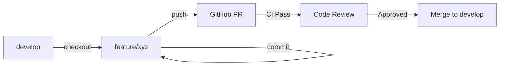

# Development Quick Reference

A quick reference guide for developers working on AntsDocShare.

## Table of Contents

- [Quick Setup](#quick-setup)
- [Common Commands](#common-commands)
- [Testing Checklist](#testing-checklist)
- [Troubleshooting](#troubleshooting)
- [Git Workflow](#git-workflow)
- [Code Snippets](#code-snippets)

## Quick Setup

```bash
# 1. Clone and setup
git clone https://github.com/YOUR_USERNAME/AntsDocShare.git
cd AntsDocShare

# 2. Create environment file
cp .env.example .env
# Edit .env with your values

# 3. Start Docker containers
docker-compose up -d

# 4. Install dependencies
docker-compose exec php composer install

# 5. Verify setup
docker-compose ps
curl http://localhost:8080
```

## Common Commands

### Docker Operations

```bash
# Start all services
docker-compose up -d

# Stop all services
docker-compose down

# Stop and remove volumes (fresh start)
docker-compose down -v

# View logs
docker-compose logs -f
docker-compose logs -f php
docker-compose logs -f nginx
docker-compose logs -f mysql

# Rebuild containers
docker-compose build --no-cache
docker-compose up -d --force-recreate

# Access containers
docker-compose exec php bash
docker-compose exec mysql bash
docker-compose exec nginx sh

# Check container status
docker-compose ps
```

### PHP/Composer Commands

```bash
# Install dependencies
docker-compose exec php composer install

# Update dependencies
docker-compose exec php composer update

# Validate composer.json
docker-compose exec php composer validate --strict

# Dump autoload
docker-compose exec php composer dump-autoload -o

# Check PHP version
docker-compose exec php php -v

# Run PHP syntax check
docker-compose exec php find . -name "*.php" -not -path "./vendor/*" -exec php -l {} \;
```

### Database Commands

```bash
# Access MySQL CLI
docker-compose exec mysql mysql -u pdgp_user -pYOUR_PASSWORD pdgp_db

# As root user
docker-compose exec mysql mysql -u root -pYOUR_ROOT_PASSWORD

# Run schema migration
docker-compose exec mysql mysql -u root -pYOUR_ROOT_PASSWORD pdgp_db < /docker-entrypoint-initdb.d/01-schema.sql

# Export database
docker-compose exec mysql mysqldump -u root -pYOUR_ROOT_PASSWORD pdgp_db > backup.sql

# Import database
docker-compose exec -T mysql mysql -u root -pYOUR_ROOT_PASSWORD pdgp_db < backup.sql

# Check tables
docker-compose exec mysql mysql -u root -pYOUR_ROOT_PASSWORD pdgp_db -e "SHOW TABLES;"

# Describe table structure
docker-compose exec mysql mysql -u root -pYOUR_ROOT_PASSWORD pdgp_db -e "DESCRIBE users;"
```

### Git Commands

```bash
# Create feature branch
git checkout develop
git pull origin develop
git checkout -b feature/your-feature-name

# Stage and commit
git add .
git commit -m "feat: your feature description"

# Push to remote
git push origin feature/your-feature-name

# Update from remote
git fetch origin
git pull origin develop

# View status
git status
git log --oneline -10

# View changes
git diff
git diff --cached
```

## Testing Checklist

### Before Committing

```bash
# 1. PHP Syntax Check
cd server
find . -name "*.php" -not -path "./vendor/*" -exec php -l {} \;

# 2. Validate Composer
composer validate --strict

# 3. Check for common issues
grep -r "var_dump\|print_r\|die(" --include="*.php" src/ || echo "Clean!"

# 4. Test database connection
docker-compose exec php php -r "
require 'vendor/autoload.php';
\$db = new \App\Config\Database();
echo 'Database connection: OK\n';
"
```

### Manual Testing Workflow

```bash
# 1. Fresh start
docker-compose down -v
docker-compose up -d
sleep 10

# 2. Test login
curl -X POST http://localhost:8080/api/auth/login \
  -H "Content-Type: application/json" \
  -d '{"username":"admin","password":"changeme"}'

# 3. Test API with token
TOKEN="your-jwt-token"
curl -X GET http://localhost:8080/api/sites \
  -H "Authorization: Bearer $TOKEN"

# 4. Check logs
docker-compose logs php | tail -50
```

## Troubleshooting

### Common Issues

#### Port Already in Use

```bash
# Find process using port 8080
lsof -i :8080  # Mac/Linux
netstat -ano | findstr :8080  # Windows

# Kill the process or change port in docker-compose.yml
```

#### Composer Install Fails

```bash
# Clear composer cache
docker-compose exec php composer clear-cache

# Remove vendor and reinstall
rm -rf server/vendor
docker-compose exec php composer install
```

#### Database Connection Error

```bash
# Check MySQL is running
docker-compose ps mysql

# Check logs
docker-compose logs mysql

# Verify credentials in .env
cat .env | grep DB_

# Test connection
docker-compose exec mysql mysqladmin ping -h localhost -u root -pYOUR_PASSWORD
```

#### Permission Issues (Linux)

```bash
# Fix storage permissions
sudo chown -R $USER:$USER server/storage
chmod -R 775 server/storage

# Or in container
docker-compose exec php chown -R www-data:www-data storage
docker-compose exec php chmod -R 775 storage
```

#### Autoload Errors

```bash
# Regenerate autoload files
docker-compose exec php composer dump-autoload -o
```

### Debug Mode

```bash
# Enable PHP error display (development only)
# Edit server/public/index.php:
ini_set('display_errors', 1);
error_reporting(E_ALL);

# View PHP errors
docker-compose logs php | grep -i error
```

## Git Workflow

### Feature Development



### Commit Message Format

```
type(scope): subject

body (optional)

footer (optional)
```

**Types:**
- `feat`: New feature
- `fix`: Bug fix
- `docs`: Documentation
- `style`: Formatting
- `refactor`: Code restructuring
- `test`: Tests
- `chore`: Maintenance

**Examples:**
```bash
git commit -m "feat(api): add product search endpoint"
git commit -m "fix(auth): resolve token expiration bug"
git commit -m "docs(readme): update installation steps"
```

## Code Snippets

### Creating a New Controller

```php
<?php

namespace App\Controllers;

class NewController
{
    public function index(): void
    {
        header('Content-Type: application/json');
        echo json_encode(['status' => 'success']);
    }
}
```

### Adding a New Route

```php
// In Router.php
$router->add('GET', '/api/resource', [NewController::class, 'index']);
```

### Database Query

```php
$db = Database::getInstance();
$stmt = $db->prepare("SELECT * FROM users WHERE id = ?");
$stmt->execute([$userId]);
$user = $stmt->fetch(PDO::FETCH_ASSOC);
```

### JWT Authentication

```php
$jwt = new JWTHandler();
$token = $jwt->encode([
    'user_id' => $user['id'],
    'role' => $user['role']
]);

// Verify
$payload = $jwt->decode($token);
```

### API Response Format

```php
// Success
header('Content-Type: application/json');
http_response_code(200);
echo json_encode([
    'status' => 'success',
    'data' => $data
]);

// Error
http_response_code(400);
echo json_encode([
    'status' => 'error',
    'message' => 'Invalid input'
]);
```

## Environment Variables

```bash
# Required in .env
DB_HOST=mysql
DB_PORT=3306
DB_NAME=pdgp_db
DB_USER=pdgp_user
DB_PASSWORD=your_password
DB_ROOT_PASSWORD=root_password
JWT_SECRET=your-secret-key-min-32-chars
```

## Useful URLs

- **Application**: http://localhost:8080
- **phpMyAdmin**: http://localhost:8081
- **API Base**: http://localhost:8080/api

## File Structure Quick Reference

```
server/
├── public/
│   ├── index.php         # Entry point
│   └── css/              # Stylesheets
├── src/
│   ├── Api/
│   │   └── Router.php    # Route definitions
│   ├── Auth/
│   │   ├── AuthMiddleware.php
│   │   └── JWTHandler.php
│   ├── Config/
│   │   ├── App.php       # App config
│   │   └── Database.php  # DB connection
│   ├── Controllers/      # Request handlers
│   ├── Models/           # Data models
│   └── Services/         # Business logic
├── views/                # HTML templates
├── database/
│   ├── schema.sql        # Database schema
│   └── seed.sql          # Initial data
└── storage/              # File storage
    ├── assets/
    ├── packages/
    └── temp/
```

## Performance Tips

```bash
# Optimize Composer autoloader
composer dump-autoload -o

# Clear Docker build cache
docker builder prune

# Monitor container resources
docker stats

# Database query optimization
docker-compose exec mysql mysql -u root -pPASSWORD pdgp_db -e "SHOW PROCESSLIST;"
```

## Security Checklist

- [ ] Never commit .env files
- [ ] Use prepared statements for SQL
- [ ] Validate all user input
- [ ] Sanitize file uploads
- [ ] Use HTTPS in production
- [ ] Rotate JWT secrets regularly
- [ ] Keep dependencies updated
- [ ] Review `composer audit` output

## CI/CD Status

Check workflow status at:
```
https://github.com/YOUR_USERNAME/AntsDocShare/actions
```

Run local checks:
```bash
# Full pre-commit check
./scripts/pre-commit-check.sh  # (create this script)

# Or manually:
cd server && \
  find . -name "*.php" -not -path "./vendor/*" -exec php -l {} \; && \
  composer validate --strict && \
  echo "All checks passed!"
```

---

**Quick Links:**
- [Main README](../README.md)
- [Contributing Guide](../CONTRIBUTING.md)
- [Workflow Documentation](WORKFLOWS.md)
- [Changelog](../CHANGELOG.md)

